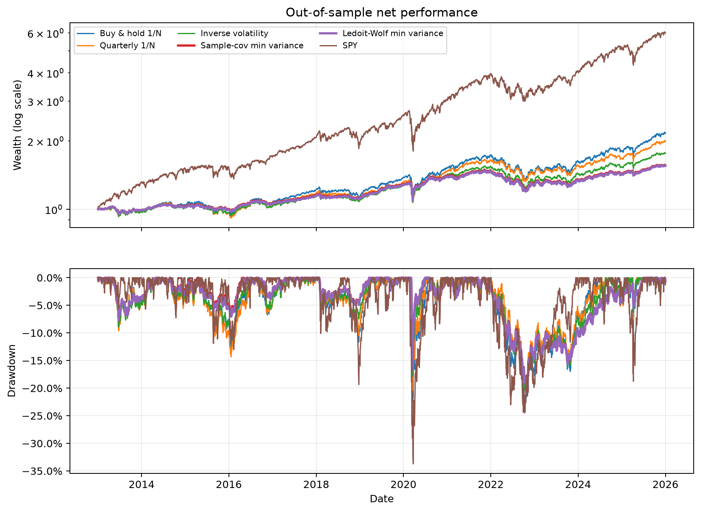
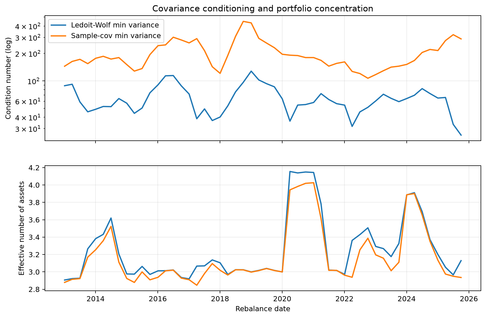
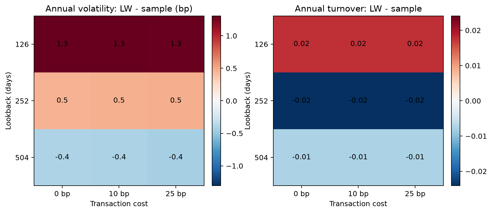

# Covariance Shrinkage in Cross-Asset ETF Portfolios

Does a better-conditioned covariance estimate produce a better out-of-sample
minimum-variance portfolio? I compare the sample covariance matrix with
scikit-learn's Ledoit-Wolf shrinkage estimator in a causal, quarterly walk-forward
study. I find a mixed result: shrinkage materially improves numerical conditioning,
but does not improve risk in my pre-specified main experiment.

## Main finding

I evaluate **3,270 daily observations from 2013-01-02 to 2025-12-31** across nine
cross-asset ETFs. I report all figures below net of 10 bp costs on traded notional.

| Strategy | CAGR | Volatility | Sharpe | Max drawdown | Annual turnover |
|---|---:|---:|---:|---:|---:|
| Buy & hold 1/N | 6.12% | 10.14% | 0.64 | -22.95% | 0.08 |
| Quarterly 1/N | 5.44% | 9.15% | 0.63 | -20.53% | 0.24 |
| Inverse volatility | 4.47% | 7.57% | 0.62 | -20.56% | 0.33 |
| Sample-cov min variance | 3.50% | **6.23%** | 0.58 | **-19.23%** | 0.65 |
| Ledoit-Wolf min variance | 3.46% | 6.24% | 0.58 | -19.41% | **0.63** |
| SPY | **14.79%** | 16.94% | **0.90** | -33.72% | 0.08 |

In my experiment, Ledoit-Wolf reduced the median covariance condition number by
**65.9%** (180.3 to 61.5) and annual turnover by 0.024 versus sample covariance.
However, its main-setting volatility was 0.005 percentage points higher and its
drawdown was 0.18 percentage points deeper. I observe lower volatility in only
**3 of 9** lookback-cost scenarios, all at the 504-day lookback. I therefore find
evidence of better conditioning, not a general out-of-sample performance advantage.



## Experiment

- Universe: I use SPY, EFA, EEM, TLT, TIP, LQD, GLD, DBC, and VNQ.
- Data: I download auto-adjusted Yahoo Finance closes through `yfinance`, from
  2007-01-03 to 2025-12-31, and keep the local cache outside Git.
- Allocation rules: I compare buy-and-hold 1/N, quarterly 1/N, inverse volatility,
  sample-covariance minimum variance, Ledoit-Wolf minimum variance, and SPY.
- Optimisation: I use SciPy SLSQP for the two minimum-variance portfolios, with
  fully invested, long-only weights and a maximum 40% allocation per asset.
- Timing: on each quarter's first observed trading day, I use exactly the previous
  252 returns; every training date is strictly earlier than its effective date.
- Accounting: I model daily weight drift, include the initial trade, define turnover as
  `sum(abs(target - pre_trade_weights))`, and charge 10 bp per unit of traded notional.
- Robustness: I cross 126/252/504-day lookbacks with 0/10/25 bp costs and evaluate
  three pre-specified market regimes.
- Risk validation: I report positive-loss historical 95% VaR/CVaR and 252-day
  rolling VaR. The two minimum-variance portfolios produced 5.33% and 5.50% breach
  rates over 3,018 forecasts; Kupiec p-values were 0.404 and 0.214.

I use scikit-learn's Ledoit-Wolf estimator and SciPy's SLSQP solver rather than
presenting either library method as my own. I implement the data contracts, portfolio
constraints, causal target generation, weight and cost accounting, risk tests,
experiment grid, and reporting.

## Evidence

- [Main performance table](reports/tables/main_performance.csv)
- [Sensitivity table](reports/tables/sensitivity.csv)
- [VaR backtest](reports/tables/var_backtest.csv)
- [Regime metrics](reports/tables/regime_metrics.csv)
- [Covariance diagnostics](reports/tables/covariance_diagnostics.csv)
- [Machine-readable findings](reports/tables/research_findings.json)
- [Executed research notebook](notebooks/research/01_covariance_shrinkage_study.ipynb)
- [Methodology](docs/METHODOLOGY.md)





## Reproduce

The commands below use Python 3.12 from Windows Git Bash.

```bash
py -3.12 -m venv .venv
./.venv/Scripts/python.exe -m pip install -e ".[dev]"
./.venv/Scripts/python.exe -m pytest -q
./.venv/Scripts/python.exe scripts/run_experiment.py --refresh-data
./.venv/Scripts/python.exe scripts/build_research_notebook.py
```

When I rerun with `--refresh-data`, the last decimals can change if the upstream vendor
revises adjusted prices. I record the data interval, configuration, run timestamp, and
dependency versions in `reports/tables/run_metadata.json`.

## Limitations

I fix the ETF universe with hindsight, so I do not eliminate selection or survivorship
bias. I use adjusted daily closes and do not model intraday execution, bid-ask spreads,
market impact, taxes, or fund closure risk. My nine liquid ETFs also form a
low-dimensional setting in which shrinkage may offer less benefit than in a larger
asset universe. I do not estimate statistical uncertainty around the small differences
between the two minimum-variance portfolios, and the Kupiec test does not test breach
independence. I treat the results as historical comparisons, not investment advice or
evidence of future performance.

## References

- Ledoit, O. and Wolf, M. (2004), [A well-conditioned estimator for
  large-dimensional covariance matrices](https://doi.org/10.1016/S0047-259X(03)00096-4).
- DeMiguel, V., Garlappi, L. and Uppal, R. (2009), [Optimal versus naive
  diversification](https://doi.org/10.1093/rfs/hhm075).
- Kupiec, P. (1995), [Techniques for verifying the accuracy of risk measurement
  models](https://fraser.stlouisfed.org/title/finance-economics-discussion-series-1491/techniques-verifying-accuracy-risk-measurement-models-717921).
- [scikit-learn `LedoitWolf` API](https://scikit-learn.org/stable/modules/generated/sklearn.covariance.LedoitWolf.html).
